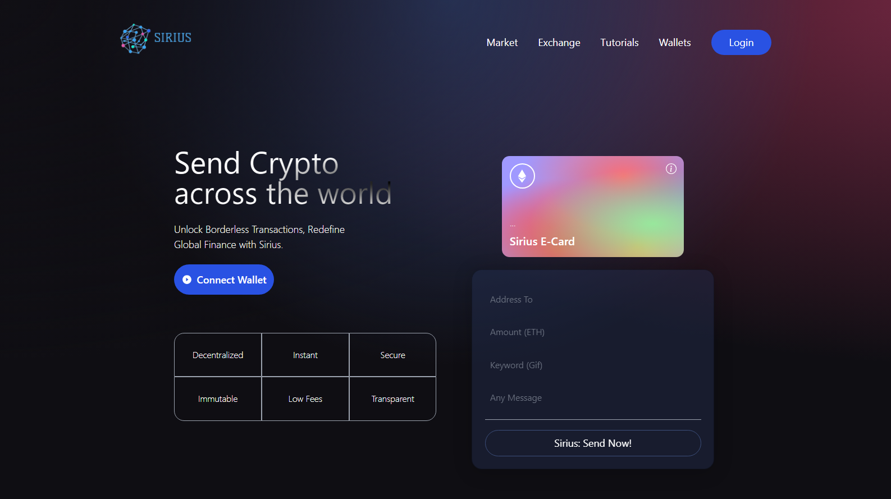

## Sirius Crypto Payment Project FullStack

Welcome to the the Sirius Web3 Crypto Payment project! This README provides an overview of the client-side implementation of the project, which enables users to make crypto payments and fetches Giphy GIFs to celebrate successful transactions.



# Overview

The client folder contains the following subfolders:

components: Reusable React components used throughout the application.
hooks: Custom React hooks that provide functionality for interacting with the blockchain and fetching Giphy GIFs.
utils: Utility functions for formatting data, handling errors, and performing other miscellaneous tasks.
transactionContext: A React context that manages the state of transactions and provides a way to share transaction data between components.
Giphy Integration

One of the unique features of the Sirius Web3 Crypto Payment project is its integration with Giphy. When a user makes a successful transaction, the application fetches a random GIF from Giphy to celebrate the occasion. This is achieved through the useGiphy hook, which takes the transaction hash as an input and returns a GIF URL.

Try running some of the following tasks:

```shell
npx hardhat accounts
npx hardhat compile
npx hardhat clean
npx hardhat test
npx hardhat node
node scripts/sample-script.js
npx hardhat help
```

# Getting Started

To get started with the client folder, make sure you have Node.js and npm installed on your machine. Then, run the following commands:

npm install
npm start
This will start the development server and make the application available at http://localhost:3000.
